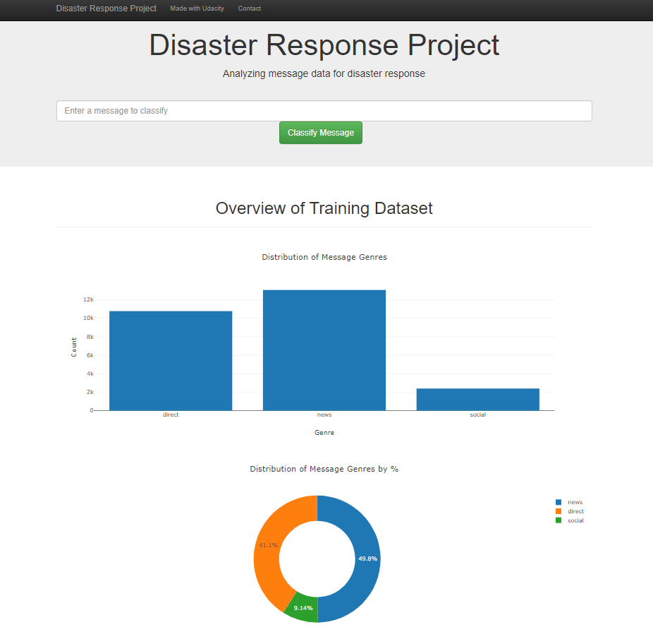

# Disaster Response Pipeline
This project was used to apply the data engineering skills learned in the Nanodegree. I analyzed disaster response data to build a model for an API to classify disaster messages.

## File Structure

    ├── app     
    │   ├── run.py                           # Flask file that runs app
    │   └── templates   
    │       ├── go.html                      # Classification result page of web app
    │       └── master.html                  # Main page of web app    
    ├── data                   
    │   ├── disaster_categories.csv          # Dataset including all the categories  
    │   ├── disaster_messages.csv            # Dataset including all the messages
    │   └── process_data.py                  # Data cleaning
    │   └── DisasterResponse.db              # Database to save clean data to
    ├── models
    │   └── train_classifier.py              # Train ML model
    │   └── classifier.pkl                   # Saved model
    ├── test
    │   └── all files used for prototyping   # All notebooks and raw files used to create this app
    └── README.md
    
### Instructions: (Run run.py directly if DisasterResponse.db and claasifier.pkl already exist.)

#### If DisasterResponse.db and classifier.pkl already exists, run "run.py". Otherwise follow these steps:

1. Run the following commands in the project's root directory to set up your database and model.
- To run the ETL pipeline that cleans data and stores in database:

    `python data/process_data.py data/disaster_messages.csv data/disaster_categories.csv data/DisasterResponse.db`
    
- To run the ML pipeline that trains classifier and saves:

    `python models/train_classifier.py data/DisasterResponse.db models/classifier.pkl`

2. Run the following command in the app's directory to run your web app.
    
    `python run.py`

    If there are issues at this step, first cd into app:

    `cd ./app`

    And then run it again:

    `python run.py`

3. Go to http://0.0.0.0:3001/

Once the webapp is running, it should look like this:

  
     

     

Use the diaglog box at the top of the screen to type in a message and it will get classified. The purpose for this web app is so that an emergency worker can can input a new message and get classification results in several categories.

